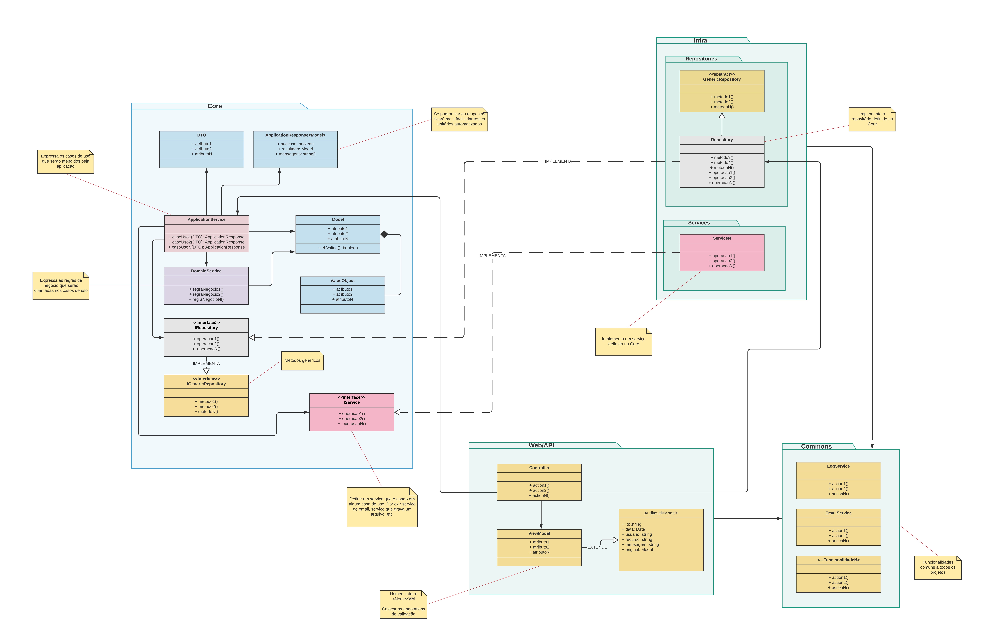

# Lab de Arquitetura
Modelo de arquitetura para isolar as `regras de negócio` de uma aplicação.

Banco fictício para demonstração de implementação de arquitetura para isolar o negócio em um projeto de API com Node.js.

Não houve a preocupação de implementar o banco de dados e outros componentes de infraestrutura, pois o objetivo é demonstrar como organizar o `core da aplicação`.

## Projetos

### banco-core
`Core da aplicação`. Aqui estão isoladas todas a regras de negócio da aplicação e a integridade garantida com testes unitários.

### banco-api
Exemplo de implementação de repositório e serviço definidos no `core da aplicação`.

### front-end
Exemplo de consumo da API em uma aplicação Angular.